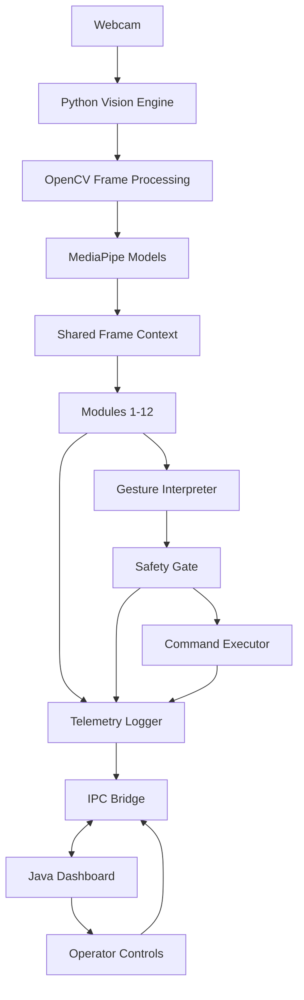

# VisionOS: AI-Powered Touchless Laptop Control System Using Hand Gestures and Human Interaction

## Overview

VisionOS is a webcam-driven, AI-assisted control system that lets a user operate a laptop without touching the keyboard or mouse. A webcam continuously monitors the user and combines OpenCV, MediaPipe AI models, a Python processing engine, and a Java desktop dashboard so the laptop behaves like a futuristic gesture-controlled interface.

Phase 1 focuses on proving the full end-to-end loop: camera input, hand/body/face analysis, gesture intent detection, safe command execution, and real-time status reporting to the Java dashboard.

## Core Idea

The core idea is to convert natural human interaction into reliable laptop commands:

1. Capture live webcam frames.
2. Detect hands, fingers, face, pose, and user state with computer-vision models.
3. Interpret the detections as gestures, modes, or safety signals.
4. Execute mapped operating-system actions such as cursor movement, clicks, scrolling, window control, or dashboard updates.
5. Stream module status, telemetry, and events to a Java dashboard over newline-delimited JSON TCP messages.

The system is designed to be modular: each interaction capability is implemented as a separate Python module, while the Java dashboard provides visibility, control, and debugging tools.

## Phase 1 Objectives

| Objective | Description | Phase 1 Outcome |
| --- | --- | --- |
| Touchless control proof of concept | Demonstrate that a webcam can drive laptop interaction without physical input. | Basic gestures trigger mouse, keyboard, and application actions. |
| Modular AI pipeline | Keep detection, gesture recognition, command execution, and telemetry separated. | Modules 1-12 can be enabled, tested, and extended independently. |
| Real-time dashboard | Provide a desktop UI for system state, module status, logs, and diagnostics. | Java dashboard receives TCP JSON events from Python. |
| Safe execution | Avoid accidental actions through confidence thresholds, active modes, and emergency stop support. | Commands require validated gestures and publish audit events. |
| Extensibility | Make it easy to add new gesture modules and dashboard panels. | New modules follow a consistent interface and IPC event format. |

## System Workflow

```text
+------------------+      +-----------------------+      +----------------------+
| Webcam / Sensor  | ---> | Python Vision Engine  | ---> | Gesture Interpreter  |
+------------------+      +-----------------------+      +----------------------+
                                |                                  |
                                v                                  v
                       +-------------------+              +-------------------+
                       | Module Registry   |              | Command Executor  |
                       +-------------------+              +-------------------+
                                |                                  |
                                v                                  v
                       +-------------------+              +-------------------+
                       | TCP IPC Publisher | -----------> | Java Dashboard    |
                       +-------------------+              +-------------------+
```

### Runtime Flow

1. **Initialize services**: Python starts the camera, loads MediaPipe/OpenCV pipelines, initializes modules, and opens the dashboard TCP client/server connection.
2. **Read frame**: The vision engine captures a webcam frame and normalizes it for downstream modules.
3. **Run detections**: Hand landmarks, pose landmarks, face information, and other state are computed.
4. **Evaluate modules**: Modules 1-12 inspect the shared frame context and emit gesture events, warnings, or commands.
5. **Execute commands**: Validated commands are sent to OS automation adapters.
6. **Publish telemetry**: Every important state transition is serialized as newline-delimited JSON and sent to the Java dashboard.
7. **Render dashboard**: Java displays active modules, command history, connection state, confidence values, and errors.

## Modules 1-12

| Module | Name | Purpose | Primary Outputs |
| --- | --- | --- | --- |
| 1 | Camera Capture | Opens the webcam, reads frames, handles FPS and resolution settings. | Frame packets, camera health, FPS telemetry. |
| 2 | Hand Landmark Detection | Uses hand-tracking models to detect palms, fingers, and landmark coordinates. | Hand landmarks, handedness, detection confidence. |
| 3 | Gesture Recognition | Converts landmark patterns into semantic gestures. | Gesture name, confidence, duration, active hand. |
| 4 | Cursor Control | Maps hand position and motion to mouse pointer movement. | Cursor coordinates, smoothing state, movement commands. |
| 5 | Click & Selection | Detects tap, pinch, hold, and release gestures for mouse clicks. | Click, double-click, drag-start, drag-end commands. |
| 6 | Scroll & Navigation | Interprets vertical/horizontal hand motion for page and document navigation. | Scroll delta, swipe direction, navigation events. |
| 7 | Keyboard Shortcut Control | Maps gestures to configured keyboard shortcuts. | Hotkey commands, shortcut labels, command status. |
| 8 | Window & App Control | Provides gesture-driven window switching, minimize/maximize, and app focus actions. | Window command events, active-app metadata. |
| 9 | Face & Attention Monitor | Observes face presence, attention, and user-away state. | Face detected, attention score, away/return events. |
| 10 | Safety & Emergency Stop | Prevents accidental control through lock gestures, confidence gates, and stop commands. | Safety mode, blocked commands, emergency-stop events. |
| 11 | Telemetry & Logging | Aggregates metrics, logs, command traces, and module health. | Structured logs, metrics, heartbeat messages. |
| 12 | IPC Bridge | Sends and receives newline-delimited JSON messages between Python and Java. | Dashboard events, dashboard commands, acknowledgements. |

### Module Contract

Each module should follow a predictable lifecycle:

```python
class VisionModule:
    name = "module_name"
    enabled = True

    def setup(self, context):
        """Allocate resources and register dashboard metadata."""

    def process(self, frame, context):
        """Read frame/context data and return zero or more events."""

    def teardown(self):
        """Release resources cleanly when the engine stops."""
```

## Java Dashboard

The Java dashboard is the operator-facing control center for Phase 1. It should make the Python engine observable and easier to debug.

### Dashboard Responsibilities

| Area | Responsibility |
| --- | --- |
| Connection status | Show whether the Python engine is connected, disconnected, or reconnecting. |
| Module monitor | Display modules 1-12, enabled state, health, FPS, latency, and last event time. |
| Event console | Render newline-delimited JSON events in a readable log view. |
| Command history | Show gestures recognized, commands executed, blocked commands, and errors. |
| Safety controls | Provide lock/unlock, emergency stop, and module enable/disable controls. |
| Diagnostics | Surface confidence scores, camera status, dropped frames, and IPC latency. |

### Suggested Dashboard Panels

```text
+---------------------------------------------------------------+
| VisionOS Dashboard                                            |
+----------------------+----------------------+-----------------+
| Connection           | Active Gesture       | Safety State    |
+----------------------+----------------------+-----------------+
| Module Health Table                                           |
+---------------------------------------------------------------+
| Event Log / JSON Stream                                       |
+---------------------------------------------------------------+
| Command History                    | Diagnostics              |
+------------------------------------+--------------------------+
```

## Architecture Diagram



### Component Summary

| Component | Technology | Role |
| --- | --- | --- |
| Vision Engine | Python | Coordinates capture, detection, module execution, and command dispatch. |
| Computer Vision | OpenCV + MediaPipe | Extracts landmarks and visual signals from webcam frames. |
| Command Executor | Python OS automation adapters | Converts approved actions into mouse, keyboard, and window operations. |
| IPC Bridge | TCP sockets + newline-delimited JSON | Exchanges events and commands between Python and Java. |
| Dashboard | Java desktop UI | Displays status, telemetry, logs, and safety controls. |

## IPC Protocol

Python and Java communicate over a local TCP socket using newline-delimited JSON, also called NDJSON. Each message is one complete JSON object encoded as UTF-8 and terminated with a single newline character (`\n`). This keeps the protocol simple, stream-friendly, and easy to parse from both Python and Java.

### Transport

| Property | Value |
| --- | --- |
| Protocol | TCP |
| Encoding | UTF-8 |
| Framing | One JSON object per line |
| Line ending | `\n` |
| Default host | `127.0.0.1` |
| Suggested default port | `5055` |
| Direction | Python → Java for telemetry/events, Java → Python for dashboard commands |

### Message Envelope

Every IPC message should include the following fields:

| Field | Type | Required | Description |
| --- | --- | --- | --- |
| `type` | string | Yes | Message category such as `heartbeat`, `module_status`, `gesture`, `command`, `error`, or `dashboard_command`. |
| `timestamp` | string | Yes | ISO-8601 UTC timestamp generated by the sender. |
| `source` | string | Yes | Sender identifier, for example `python.engine`, `python.module.3`, or `java.dashboard`. |
| `request_id` | string | No | Correlation ID for request/response or command acknowledgement flows. |
| `payload` | object | Yes | Message-specific data. |

### Python → Java Examples

#### Heartbeat

```json
{"type":"heartbeat","timestamp":"2026-06-06T12:00:00Z","source":"python.engine","payload":{"status":"running","fps":29.7,"active_modules":12}}
```

#### Module Status

```json
{"type":"module_status","timestamp":"2026-06-06T12:00:01Z","source":"python.module.2","payload":{"module_id":2,"name":"Hand Landmark Detection","enabled":true,"health":"ok","latency_ms":8.4,"confidence":0.93}}
```

#### Gesture Event

```json
{"type":"gesture","timestamp":"2026-06-06T12:00:02Z","source":"python.module.3","payload":{"gesture":"pinch","hand":"right","confidence":0.91,"duration_ms":180}}
```

#### Command Execution

```json
{"type":"command","timestamp":"2026-06-06T12:00:02Z","source":"python.executor","payload":{"command":"mouse.click","status":"executed","gesture":"pinch","safety_state":"unlocked"}}
```

#### Error

```json
{"type":"error","timestamp":"2026-06-06T12:00:03Z","source":"python.engine","payload":{"severity":"warning","code":"CAMERA_FRAME_DROP","message":"Frame dropped due to camera timeout"}}
```

### Java → Python Examples

#### Enable or Disable a Module

```json
{"type":"dashboard_command","timestamp":"2026-06-06T12:00:04Z","source":"java.dashboard","request_id":"cmd-1001","payload":{"command":"module.set_enabled","module_id":6,"enabled":false}}
```

#### Emergency Stop

```json
{"type":"dashboard_command","timestamp":"2026-06-06T12:00:05Z","source":"java.dashboard","request_id":"cmd-1002","payload":{"command":"safety.emergency_stop","reason":"operator_pressed_stop"}}
```

#### Command Acknowledgement

```json
{"type":"ack","timestamp":"2026-06-06T12:00:05Z","source":"python.engine","request_id":"cmd-1002","payload":{"status":"accepted","command":"safety.emergency_stop"}}
```

### Java Reader Sketch

```java
try (BufferedReader reader = new BufferedReader(new InputStreamReader(socket.getInputStream(), StandardCharsets.UTF_8))) {
    String line;
    while ((line = reader.readLine()) != null) {
        // Parse each line as one complete JSON object.
        handleJsonMessage(line);
    }
}
```

### Python Writer Sketch

```python
import json

message = {
    "type": "heartbeat",
    "timestamp": "2026-06-06T12:00:00Z",
    "source": "python.engine",
    "payload": {"status": "running"},
}
socket_file.write(json.dumps(message, separators=(",", ":")) + "\n")
socket_file.flush()
```

## Adding a New Module

Use the module lifecycle and IPC envelope so new capabilities remain consistent with the rest of the system.

### Steps

1. **Choose a module ID and name** that do not conflict with modules 1-12.
2. **Create the module class** with `setup`, `process`, and `teardown` methods.
3. **Read from the shared context** instead of duplicating expensive detections when possible.
4. **Return structured events** such as `gesture`, `module_status`, `command_request`, or `error`.
5. **Register dashboard metadata** including display name, description, enabled state, and metrics.
6. **Add safety rules** if the module can trigger OS-level actions.
7. **Write tests or manual validation steps** for expected gestures, false positives, and dashboard output.

### Example Module Event

```json
{"type":"gesture","timestamp":"2026-06-06T12:10:00Z","source":"python.module.13","payload":{"module_id":13,"name":"Custom Gesture Module","gesture":"thumbs_up","confidence":0.88}}
```

## Build & Run

The repository currently documents the Phase 1 architecture and expected runtime shape. As implementation files are added, keep this section updated with exact commands for your Python environment and Java build tool.

### Prerequisites

| Tool | Purpose |
| --- | --- |
| Python 3.10+ | Runs the vision engine and modules. |
| OpenCV | Processes webcam frames. |
| MediaPipe | Provides hand, pose, and face landmark detection. |
| Java 17+ | Runs the desktop dashboard. |
| Webcam | Provides live interaction input. |

### Suggested Python Setup

```bash
python -m venv .venv
source .venv/bin/activate
pip install opencv-python mediapipe
python main.py
```

### Suggested Java Dashboard Run

```bash
javac Dashboard.java
java Dashboard --host 127.0.0.1 --port 5055
```

### Suggested Startup Order

1. Start the Java dashboard and wait for it to listen on `127.0.0.1:5055`.
2. Start the Python vision engine.
3. Confirm that the dashboard receives `heartbeat` messages.
4. Enable one module at a time and validate events in the dashboard log.
5. Use the emergency stop control before testing high-impact commands.

## Future Phases

| Phase | Focus | Potential Features |
| --- | --- | --- |
| Phase 2 | Robust control | Gesture calibration, user profiles, improved smoothing, configurable shortcuts. |
| Phase 3 | Multimodal AI | Voice commands, gaze estimation, context-aware command suggestions. |
| Phase 4 | Productivity workflows | App-specific gesture packs for browsers, IDEs, presentations, and media tools. |
| Phase 5 | Security and deployment | Permissions model, signed releases, installer, audit logs, privacy controls. |
| Phase 6 | Advanced interaction | Multi-user support, AR-style overlays, adaptive learning, custom gesture training. |

## Documentation Maintenance

When the implementation grows, keep this README synchronized with the actual source tree, module names, command-line options, IPC port, and dashboard build commands.
